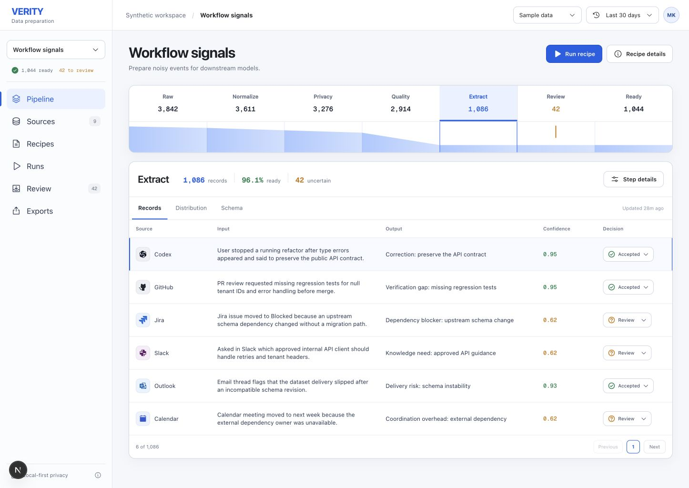

# Verity

Verity is a white-box data preparation workbench. It turns noisy, heterogeneous events into reviewable, reproducible datasets for analytics, recommendation systems, traditional ML, transformer training, and future post-training workflows.



The repository is intentionally source-agnostic. Codex, Claude Code, GitHub, Jira, Slack, Outlook, Calendar, Confluence, and PowerPoint are synthetic demo adapters, not the platform boundary. Any connector can emit the small `raw-event` contract and enter the same pipeline.

## What works now

- 3,842 deterministic, deliberately noisy demo events across nine sample sources
- versioned stages for normalization, privacy, quality, extraction, review, and publication
- Parquet stage snapshots, JSONL decision lineage, DuckDB inspection, and Polars transforms
- a human review loop for uncertain records
- a clean Next.js workbench with progressive-disclosure dialogs and responsive views
- a FastAPI control plane with checked-in JSON Schema and OpenAPI contracts
- an optional Dagster adapter without coupling the core recipe runner to one orchestrator

The demo funnel is reproducible: `3,842 raw -> 3,611 normalized -> 3,276 privacy-safe -> 2,914 quality-passed -> 1,086 extracted -> 42 review + 1,044 ready`.

## Run locally

Requirements: Node.js 22+, Python 3.11+, and [uv](https://docs.astral.sh/uv/).

```bash
make bootstrap
make generate
make api
```

In a second terminal:

```bash
make web
```

Open `http://127.0.0.1:3000`. The web app falls back to the checked-in synthetic snapshot when the API is not running.

Run every verification step with:

```bash
make verify
```

Or start both services with Docker:

```bash
docker compose up --build
```

## Repository map

```text
apps/web                 Next.js workbench
apps/api                 FastAPI reference control plane and local recipe runner
packages/contracts       Language-neutral event, operator, decision, and API contracts
sample_data/raw          Generated local JSONL inputs (ignored by Git)
artifacts                Generated Parquet and decision artifacts (ignored by Git)
docs                     Architecture, privacy, reuse decisions, and visual QA
```

The FastAPI service is a replaceable reference implementation. A future Go control plane can implement `packages/contracts/openapi.json` and reuse the same JSON schemas and artifact conventions.

## Design principles

- White-box by default: every stage exposes input, output, retention, operator version, and decision reason.
- Progressive disclosure: the primary screen stays calm; source details, schema, lineage, evidence, and export controls open only when requested.
- Local-first privacy: raw prompts, files, and message bodies are treated as local-only. Shareable layers contain redacted events, derived signals, provenance, and policy decisions.
- Human judgment at uncertainty: low-confidence records branch to review instead of silently entering training data.
- Portable contracts: connectors and operators depend on schemas, not on Python or a specific orchestrator.

See [architecture](docs/architecture.md), [privacy boundary](docs/privacy.md), and [open-source reuse](docs/oss-reuse.md) for the implementation rationale.
