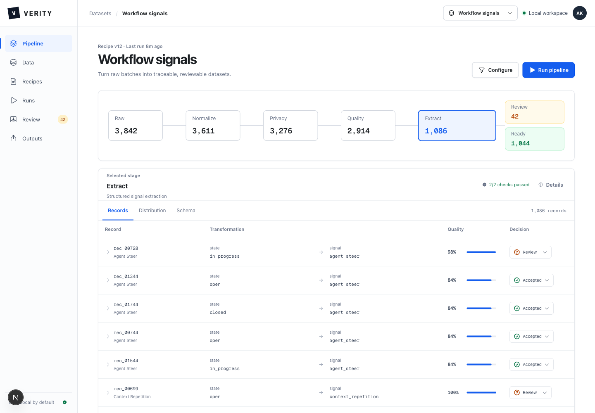

# Verity

Verity is a white-box data preparation workbench. It turns noisy, heterogeneous events into reviewable, reproducible datasets for analytics, recommendation systems, traditional ML, transformer training, and future post-training workflows.



The repository is dataset-first. Inputs arrive as independent batches of generic records. Origin can be carried in optional metadata, but the pipeline and UI do not depend on a fixed list of sources.

## What works now

- resumable streaming imports for CSV, TSV, JSON, JSONL, NDJSON, Parquet, and gzip variants
- deterministic 10,000-row cross-format fixtures plus generated 100,000 and 1,000,000-row load profiles
- versioned normalization, privacy, quality, extraction, review, and publication stages
- atomic JSONL stage snapshots, CSV and Parquet exports, and JSONL decision lineage
- a persistent human review loop for uncertain decisions and resumable stage-progress events
- one upload-first workspace with automatic execution and contextual review
- a text-first stage inspector for language-shaped sources, with inline word-level changes plus a spreadsheet-style fallback for structured fields; both views keep complete, paginated before/after pairs, replay, search, column selection and page-local grouping
- disk-backed deduplication, bounded-memory stage execution, cursor pagination, and checksummed outputs
- one Go service for the control plane and in-process data plane, with strict requests, atomic local state and artifacts, ETags, readiness, optional bearer auth, structured errors, request IDs, access logs, and graceful shutdown
- checked-in JSON Schema and OpenAPI contracts
- API-backed Go CLI and official-SDK MCP server for automation
- a native optional Temporal workflow/worker for durable execution
- an optional Airbyte HTTP adapter for triggering and tracking managed ingestion jobs

The demo funnel is reproducible: `3,842 raw -> 3,611 normalized -> 3,276 privacy-safe -> 2,914 quality-passed -> 1,086 extracted -> 42 review + 1,044 ready`.

This is a tested single-workspace reference product, not an enterprise GA claim. The bundled workflow-signal recipe is an example domain implementation, not a universal cleaner. Browser cancellation/recovery, configurable recipes, production connectors, SSO/RBAC, managed secrets, tenant isolation, distributed recovery, and retention enforcement remain open. See the [implementation checkpoint](docs/product/upload-first-workbench-spec.md#implementation-checkpoint-2026-09-08) and [production readiness](docs/production-readiness.md).

## Run locally

Requirements: Node.js 22+ and Go 1.24+.

```bash
make bootstrap
make generate
make api
```

In a second terminal:

```bash
make web
```

Open `http://127.0.0.1:3000`. The web app uses the checked-in synthetic snapshot when the API is unavailable.

To exercise the complete white-box flow:

1. Drop `sample_data/examples/noisy-workflow-events.csv` on the first screen, or click the same surface to choose it.
2. Upload and the default workflow start automatically. No separate run action is required.
3. Select Raw, Normalize, Privacy, Quality, Extract, Review, and Ready. Language-shaped sources open in **Reading**: a compact evidence stream shows titles, prose, context and inline word-level changes. **Table** is available whenever you need aligned fields and dense comparison; numeric/metadata-only sources open there automatically.
4. Switch **Changes / Before / After**. In Reading, changed words are marked in place, while added/removed records are labeled. In Table, modified cells show old and new values, removed cells are struck through, and added cells are highlighted. **Replay change** briefly shows the real predecessor values before revealing the diff; reduced-motion preferences are respected.
5. Use **Next / Previous**, search across the full boundary, or filter modified/removed/added/output rows. **Columns** exposes every field, including a shortcut for fields changed on this page. **Wrap** and the expand icon give structured data more room. Select **Inspect record** (or a table cell) for complete before/after JSON. Grouping is explicitly page-local, not a whole-dataset aggregation.
6. Resolve uncertain records from the contextual review button. Every decision publishes a new downloadable snapshot without overwriting earlier outputs.

The sample deliberately contains duplicate IDs, schema aliases, sensitive values, malformed records, unsupported content, low-confidence signals, and accepted signals. It is safe synthetic data and is intended for hands-on validation.

Run unit, contract, lint, and production-build verification with:

```bash
make verify
```

Run the browser-level product flows with:

```bash
npm run test:e2e --workspace @verity/web
```

Run the same lifecycle without the UI:

```bash
cd apps/api
go run ./cmd/verity import ../../sample_data/examples/noisy-workflow-events.csv --wait --output ../../ready.parquet
```

See [CLI](docs/cli.md), [MCP](docs/mcp.md), the [verification report](docs/verification.md), and the [Kubernetes/Curvatus handoff](deploy/kubernetes/README.md). A reproducible 100,000-row end-to-end load run is `make load`; the 1,000,000-row profile is `make stress`.

The table API is `GET /api/v1/stages/{stage_id}/table?limit=100&filter=all` (see [OpenAPI](packages/contracts/openapi.json)). The first read builds a disk-backed join of immutable stage artifacts. Later pages seek into a cached JSONL boundary; the entire dataset is never sent to the browser. Cursors are tied to the run/review snapshot, filter and search. A sparse search may return an empty page with a continuation cursor. Full-boundary counts are separate from the current page's groups. Review/Ready routing is not deletion, and reviewed results use the current review revision. The text reader is a presentation layer over these same pairs: it detects prose fields from observed values, caps inline diff work for very long text, and never sends raw records anywhere other than the existing local API.

Caches include original before values and consume additional local disk space. Apply the same access and retention controls as raw stage artifacts. This is a read-only inspection table, not a general editable spreadsheet or an aggregation operator. Existing source artifacts remain unchanged.

Verify the 100,000-row inspection path separately:
```bash
cd apps/api
VERITY_TABLE_LOAD=1 go test ./internal/verity -run TestTableHundredThousandRows -count=1 -v
```

Or start both services with Docker:

```bash
docker compose up --build
```

The default deployment remains two containers: the all-Go API/engine and the web app.
For durable local orchestration through Temporal, add the optional overlay:

```bash
docker compose -f compose.yaml -f compose.temporal.yaml up --build
```

Temporal is not required for normal local use. To connect an existing Airbyte Cloud or
self-managed instance, set `VERITY_AIRBYTE_BASE_URL` and `VERITY_AIRBYTE_TOKEN`; Verity
then exposes bounded endpoints to trigger a connection sync and read its job state. See
[integrations](docs/integrations.md).

## Repository map

```text
apps/web                 Next.js workbench
apps/api                 All-Go API, pipeline engine, fixtures, and optional adapters
packages/contracts       Language-neutral event, operator, decision, and API contracts
sample_data/raw          Generated local JSONL inputs (ignored by Git)
artifacts                Generated state, JSONL/CSV/Parquet, and decision artifacts (ignored by Git)
docs                     Architecture, privacy, reuse, readiness, and visual QA
```

The Go service owns API behavior, state, idempotency, lifecycle, transformations, artifact generation, and observability. Local runs execute in-process. The same engine can run as a Temporal activity through `verity-worker`, without changing the frontend or public API. Airbyte remains a producer-side adapter rather than becoming Verity's core runtime.

## Design principles

- White-box by default: each stage exposes input, output, retention, operator version, checks, and decision reason.
- Progressive disclosure: the first view answers what happened; schema, lineage, evidence, and configuration open on demand.
- Self-hosted storage: raw files remain on the machine running the API, not necessarily the browser's machine. Real-data deployments require access control and approved privacy policies.
- Human judgment at uncertainty: low-confidence records branch to review instead of silently entering model data.
- Portable contracts: producers and operators depend on schemas, not a source logo, language, or scheduler.

See [architecture](docs/architecture.md), [integrations](docs/integrations.md), [privacy boundary](docs/privacy.md), [open-source reuse](docs/oss-reuse.md), and [production readiness](docs/production-readiness.md).
