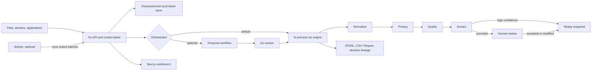

# Architecture

Verity is an all-Go data preparation service with a Next.js workbench. The default path
is deliberately small: one Go process owns both the control plane and the deterministic
data plane. Durable orchestration and managed ingestion are optional adapters.

## Go control and data plane

`apps/api` is a Go 1.24 module. It owns:

- strict, bounded HTTP request handling and language-neutral OpenAPI compatibility
- optional bearer authentication and explicit CORS allowlists
- idempotent batch staging with content checksums
- atomic, permission-restricted local state and review persistence
- START, per-stage committed, review-required, output-ready, COMPLETE, and FAIL lifecycle events
- deterministic normalization, privacy filtering, quality scoring, signal extraction,
  review routing, and publication
- atomic JSONL stage artifacts, CSV and Parquet outputs, decision lineage, and verified record counts
- readiness, ETags, request IDs, structured logs, timeouts, recovery, and graceful shutdown

The core has no Python, CGO, database server, or scheduler requirement. This keeps local
and container deployment reproducible across supported Go platforms.

## Execution backends

`VERITY_ORCHESTRATOR=local` is the default. The API calls the pipeline in-process and
protects the workspace with a one-run-at-a-time guard.

`VERITY_ORCHESTRATOR=temporal` submits the same pipeline as a native Temporal Go workflow.
`verity-worker` registers the workflow and activity, and API and worker share the artifact
store. Temporal supplies durable workflow state, retries, and worker recovery without
creating a second implementation of the recipe. API-restart reconciliation is deliberately
listed as a remaining production gate rather than claimed as complete.

## Ingestion adapters

Generic files and staged HTTP batches remain the universal input. When Airbyte is
configured, Verity can trigger a preconfigured Airbyte connection and inspect job status.
Airbyte still owns credentials, extraction, incremental cursors, and source-specific
schema discovery. Its destination should emit Verity's generic record envelope into the
approved staging location or API.

## Contracts

`packages/contracts/schemas/data-record.schema.json` is deliberately small. Every record
belongs to a dataset and batch, carries an opaque `payload`, and may include optional
`metadata`. Origin is never required.

Operators follow `operator.schema.json`: named inputs and outputs, semantic version,
configuration, and execution class. Row-level decisions follow
`decision-record.schema.json`, so filtering, classification, privacy rejection, model
scoring, and human overrides share one audit format.

`packages/contracts/openapi.json` is the API boundary. The frontend and future service
implementations depend on that contract rather than internal Go packages.

## Artifacts and state

Each successful run writes beneath `artifacts/<run_id>/`:

- one atomic JSONL snapshot per pipeline stage
- `curated.csv` for direct analysis and portable handoff
- `curated.parquet` as a typed, columnar contract for ML and analytical consumers
- `decisions.jsonl` for machine and policy decisions
- `review-overrides.jsonl` for human actions
- `workspace.json` for the safe UI projection

Staged batches live under `artifacts/staged/`; durable local control state lives under
`artifacts/control/`. Runtime runs do not modify the checked-in demo fixture.

## Next production increments

1. Connect one approved Airbyte destination to the generic batch envelope end to end.
2. Replace local JSON control state with a transactional store and tenant isolation.
3. Add SSO, RBAC/ABAC, managed secrets, audit export, retention, and deletion enforcement.
4. Add OpenLineage transport plus metrics, traces, and operational alerts.
5. Add an optional Arrow streaming adapter when zero-copy interchange is required at scale.
6. Run load, chaos, threat-model, privacy, and compliance acceptance tests.
