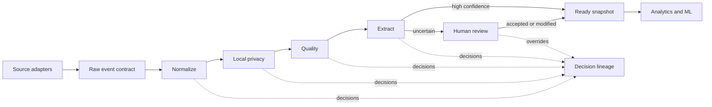

# Architecture

Verity separates data-plane contracts from the control-plane implementation. The current FastAPI service proves the interface locally; it is not a permanent language choice.

## Contracts

`packages/contracts/schemas/raw-event.schema.json` is deliberately small. `source` is an open slug, `kind` is adapter-defined, and source-native fields live in `metadata`. This lets a new database, document system, sensor, model harness, or internal service join without changing the core schema.

Operators follow `operator.schema.json`: named input and output schemas, semantic version, configuration, and execution class. Every row-level decision follows `decision-record.schema.json` so filtering, classification, privacy rejection, model scoring, and human overrides share one audit format.

The generated `packages/contracts/openapi.json` is the control-plane boundary. The future Go service should preserve this API while replacing FastAPI internals incrementally.

## Artifacts

Each run writes immutable, inspectable artifacts beneath `artifacts/<run_id>/`:

- one compressed Parquet snapshot per stage
- `decisions.jsonl` for machine and policy decisions
- `review-overrides.jsonl` for human actions
- `workspace.json` for the UI projection

The UI does not need direct access to raw local content. It receives the manager-safe workspace projection and requests deeper evidence only through an authorized endpoint.

## Next implementation increments

1. Replace synthetic readers with a connector SDK and one real local coding-agent adapter.
2. Add project-scoped recipe persistence and dataset versioning.
3. Introduce policy-aware local execution and encrypted credential brokerage.
4. Add offline evaluation, drift checks, and recommendation-model adapters.
5. Implement the production Go control plane behind the existing contracts.
