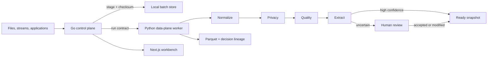

# Architecture

Verity separates a Go control plane from a replaceable data-plane engine. This is a responsibility boundary, not a partial migration.

## Control plane

`apps/api` is a dependency-light Go 1.24 service. It owns:

- strict, bounded HTTP request handling and language-neutral OpenAPI compatibility
- optional bearer authentication and explicit CORS allowlists
- idempotent batch staging with content checksums
- atomic, permission-restricted local state and review persistence
- one-run-at-a-time concurrency control
- START, COMPLETE, and FAIL lifecycle events
- readiness, ETags, request IDs, structured access logs, timeouts, recovery, and graceful shutdown
- safe invocation of the replaceable engine with bounded error output

The local JSON state is appropriate for a single-workspace reference product. It is intentionally isolated behind `Store`; production multi-user deployment should replace it with a transactional database and workspace/tenant scoping.

## Data plane

`apps/engine` uses Polars, DuckDB, PyArrow, and Pydantic for deterministic local processing. It reads one generic envelope, performs the recipe, writes immutable run artifacts, and returns a workspace projection. It never owns HTTP, authentication, or control-plane state.

The Go service invokes it through a small command contract today. The same boundary can later target a container job, Temporal activity, Dagster asset job, or the firm's internal Go framework without changing the frontend or external API.

## Contracts

`packages/contracts/schemas/data-record.schema.json` is deliberately small. Every record belongs to a dataset and batch, carries an opaque `payload`, and may include optional `metadata`. Origin is never required.

Operators follow `operator.schema.json`: named inputs and outputs, semantic version, configuration, and execution class. Row-level decisions follow `decision-record.schema.json`, so filtering, classification, privacy rejection, model scoring, and human overrides share one audit format.

`packages/contracts/openapi.json` is the control-plane boundary. The frontend and future service implementations depend on that contract rather than Go or Python internals.

## Artifacts and state

Each successful run writes beneath `artifacts/<run_id>/`:

- one compressed Parquet snapshot per stage
- `decisions.jsonl` for machine and policy decisions
- `review-overrides.jsonl` for human actions
- `workspace.json` for the safe UI projection

Staged batches live under `artifacts/staged/`; durable local control state lives under `artifacts/control/`. Runtime runs do not modify the checked-in demo fixture.

## Next production increments

1. Add connector adapters with supported OAuth/enterprise consent instead of scraping credential files.
2. Replace local JSON control state with a transactional store and tenant/workspace isolation.
3. Add SSO, RBAC/ABAC, managed secrets, audit export, retention, and deletion enforcement.
4. Add durable distributed execution and recovery through a production orchestrator.
5. Add offline evaluation, drift checks, and recommendation-model adapters.
6. Run load, chaos, threat-model, privacy, and compliance acceptance tests.
