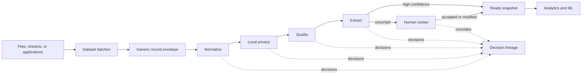

# Architecture

Verity separates data-plane contracts from the control-plane implementation. The current FastAPI service proves the interface locally; it is not a permanent language choice.

## Contracts

`packages/contracts/schemas/data-record.schema.json` is deliberately small. Every record belongs to a dataset and batch, carries an opaque `payload`, and may include optional `metadata`. Origin is never required. A database, table, document system, sensor, model harness, or internal service can therefore join without changing the core schema.

Operators follow `operator.schema.json`: named input and output schemas, semantic version, configuration, and execution class. Every row-level decision follows `decision-record.schema.json` so filtering, classification, privacy rejection, model scoring, and human overrides share one audit format.

The generated `packages/contracts/openapi.json` is the control-plane boundary. The future Go service should preserve this API while replacing FastAPI internals incrementally.

## Artifacts

Each run writes immutable, inspectable artifacts beneath `artifacts/<run_id>/`:

- one compressed Parquet snapshot per stage
- `decisions.jsonl` for machine and policy decisions
- `review-overrides.jsonl` for human actions
- `workspace.json` for the UI projection

The UI receives a safe workspace projection and requests deeper local evidence only when a user deliberately opens a record.

## Next implementation increments

1. Add production batch producers behind the generic envelope contract.
2. Add project-scoped recipe persistence and dataset versioning.
3. Introduce policy-aware local execution and encrypted credential brokerage.
4. Add offline evaluation, drift checks, and recommendation-model adapters.
5. Implement the production Go control plane behind the existing contracts.
